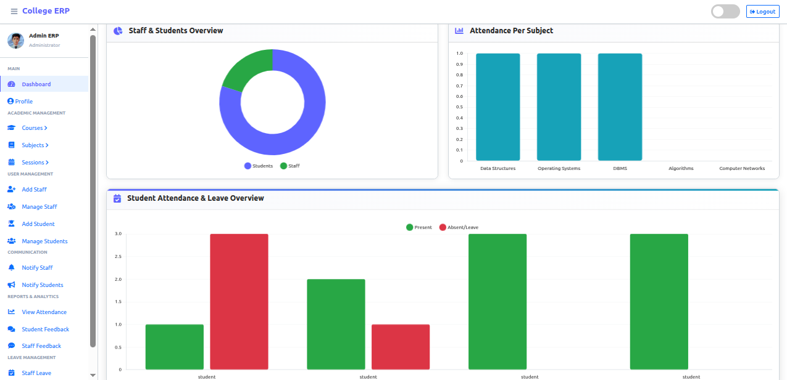
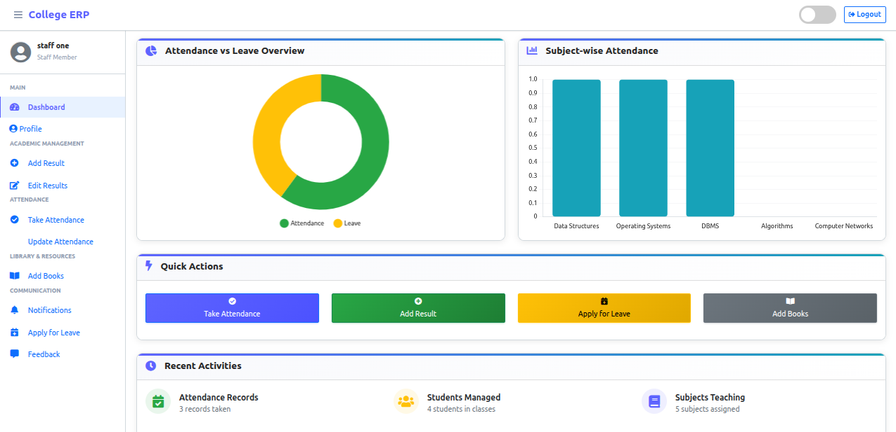
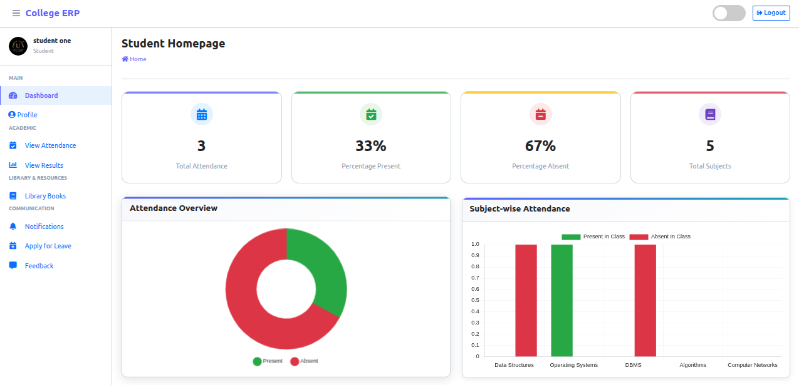

<div align="center">

# 🎓 College ERP System

### A Full-Stack Enterprise Resource Planning System for Educational Institutions

[](https://www.python.org/)
[](https://www.djangoproject.com/)
[](https://www.sqlite.org/)
[](https://getbootstrap.com/)

<br/>

**Built by [Manav Garg](mailto:manav2209garg@gmail.com)**

</div>

---

## 📌 Overview

**College ERP** is a comprehensive web-based Enterprise Resource Planning system built for educational institutions. It provides a unified platform for **Admins (HOD)**, **Staff**, and **Students** — each with a dedicated role-based portal to manage day-to-day college operations efficiently.

> The entire application is built using **Python (Django)** on the backend and **HTML, CSS, JavaScript + Bootstrap** on the frontend, with **SQLite** as the default database.

---

## 🖥️ Screenshots






---

## 👥 User Roles

This system supports **3 roles**, each with a separate interface and access level:

| Role | Description |
|------|-------------|
| 👨‍💼 **Admin (HOD)** | Full system control — manages staff, students, courses, and all records |
| 👨‍🏫 **Staff** | Manages attendance, results, leave, and sends feedback to admin |
| 🎓 **Student** | Views attendance, results, applies for leave, and sends feedback |

---

## 🚀 Features

### 👨‍💼 Admin Panel
- 📊 Analytics dashboard with charts (students, staff, courses, subjects)
- 👥 Full CRUD for Staff & Student accounts
- 📚 Course & Subject management
- 📅 Academic Session management
- ✅ Attendance monitoring across all subjects
- 💬 View & reply to feedback from Staff and Students
- 🏖️ Approve / Reject leave requests
- 🔔 Send notifications to Staff and Students
- 📚 Library & Book management (issue/return tracking)

### 👨‍🏫 Staff Panel
- 📊 Personal performance dashboard
- ✏️ Mark & update student attendance
- 📝 Add & edit student exam/test results
- 🏖️ Apply for leave
- 💬 Send feedback to Admin
- 🔔 View notifications from Admin

### 🎓 Student Panel
- 📊 Personal dashboard (attendance %, results, leave status)
- 📅 View subject-wise attendance records
- 🎯 View test & exam results per subject
- 🏖️ Apply for leave
- 💬 Send feedback to Admin
- 🔔 View notifications from Admin

---

## 🛠️ Tech Stack

| Layer | Technology |
|-------|-----------|
| **Language** | Python 3.x |
| **Framework** | Django 4.2 |
| **Frontend** | HTML5, CSS3, JavaScript, Bootstrap |
| **Database** | SQLite (dev) / PostgreSQL (production ready) |
| **Auth** | Custom email-based Django Auth + role middleware |
| **Email** | SMTP via Gmail |
| **Static Files** | WhiteNoise |

---

## ⚙️ Project Structure

```
College-ERP/
│
├── college_management_system/   # Django project settings & URLs
│   ├── settings.py
│   └── urls.py
│
├── main_app/                    # Core application
│   ├── models.py                # All DB models (User, Student, Staff, etc.)
│   ├── views.py                 # Common views (login, home redirect)
│   ├── hod_views.py             # Admin/HOD views
│   ├── staff_views.py           # Staff views
│   ├── student_views.py         # Student views
│   ├── middleware.py            # Role-based access control middleware
│   ├── EmailBackend.py          # Email authentication backend
│   ├── forms.py                 # Django forms
│   ├── urls.py                  # App URL routes
│   └── templates/               # HTML templates for all portals
│
├── media/                       # Uploaded profile pictures
├── Showcase/                    # Screenshots
├── manage.py
└── requirements.txt
```

---

## 📥 Installation & Setup

### Prerequisites
- Python 3.8+
- pip

### Steps

**1. Clone the repository**
```bash
git clone <your-repo-url>
cd College-ERP
```

**2. Create & activate virtual environment**
```bash
# macOS / Linux
python3 -m venv venv
source venv/bin/activate

# Windows
python -m venv venv
source venv/scripts/activate
```

**3. Install dependencies**
```bash
pip install -r requirements.txt
```

**4. Apply migrations**
```bash
python manage.py migrate
```

**5. Run the development server**
```bash
python manage.py runserver
```

**6. Open in browser**
```
http://127.0.0.1:8000
```

---

## 🔑 Default Login

| Role | Email | Password |
|------|-------|----------|
| 👨‍💼 Admin | `admin@admin.com` | `admin123` |
| 👨‍🏫 Staff | `staffone@staff.com` | *(set by admin)* |
| 🎓 Student | `studentone@student.com` | *(set by admin)* |

> **Note:** There is no public sign-up. All accounts are created by the Admin from the dashboard.

---

## 🗄️ Data Models

| Model | Description |
|-------|-------------|
| `CustomUser` | Extended Django user with email login & role type |
| `Admin` | Linked to HOD user |
| `Staff` | Linked to staff user + assigned course |
| `Student` | Linked to student user + course + session |
| `Course` | Academic courses (e.g., B.Tech, MBA) |
| `Subject` | Subjects linked to a course and staff member |
| `Session` | Academic year/term |
| `Attendance` | Per-subject attendance record |
| `AttendanceReport` | Per-student attendance status per session |
| `StudentResult` | Test & exam marks per subject |
| `LeaveReportStudent` | Student leave applications |
| `LeaveReportStaff` | Staff leave applications |
| `FeedbackStudent` | Student feedback + admin reply |
| `FeedbackStaff` | Staff feedback + admin reply |
| `NotificationStudent` | Admin → Student notifications |
| `NotificationStaff` | Admin → Staff notifications |
| `Book` | Library book records |
| `IssuedBook` | Book issue tracking with expiry |

---

## 📧 Contact

- **Developer:** Manav Garg
- **Email:** [manav2209garg@gmail.com](mailto:manav2209garg@gmail.com)

---

<div align="center">
  <strong>Made with ❤️ by Manav Garg</strong>
</div>
